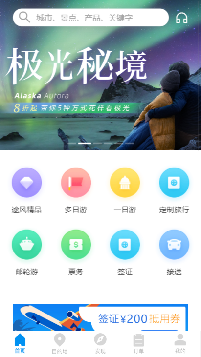
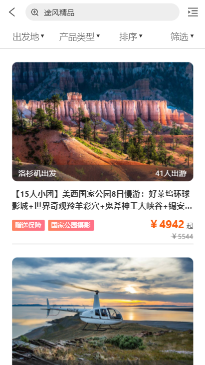
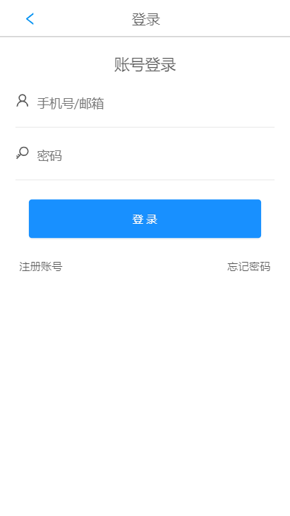
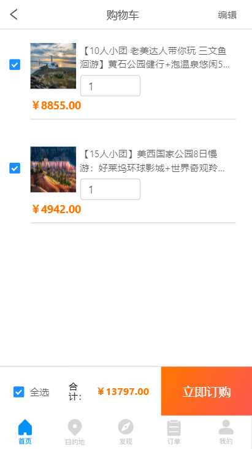

# 项目说明

基于React框架的webApp项目 + 后台管理系统

### 途风旅游网项目

### 项目类型
* 旅游类电商

##### 说明：旅游类电商Webapp。
```
项目组成员：陈旭东，杨天辉，梁智钊，吴艺苑
```

##### 参考网址（途风旅游官网）：https://m.toursforfun.com

##### 演示网址（demo）：http://119.3.166.163:8888

##### 演示网址（后台）：http://119.3.166.163:8899
* 登陆账号：chen  密码：123

##### gitHub仓库项目地址：git@github.com:gzh51906/Toursf.git

##### 主要功能：首页、详情页、分类页、购物车、登陆、注册和后台管理系统。

### 项目分工

* 陈旭东：布局、数据、列表页、详情页、购物车、后台增删改查
* 杨天辉：负责App项目的"目的地"组件，主要功能：路由跳转到列表页，跳转到搜索页、完成搜索页ui布局，部分商品带参数跳转到详情页、详情页数据渲染；"登录注册"组件，主要功能：完成了登录注册和退出功能，鉴权，token令牌 ；
* 梁智钊：负责后台管理系统的界面、路由跳转、利用ant-design UI框架内部分组件实现商品和用户展示、编辑和新增商品UI，完成部分用户交互UI（如全局提示和确认框等）
* 吴艺苑：负责项目的首页，主要功能：利用antdesgin UI框架完成首页ui布局和数据渲染 路由跳转到详情页页，搜索页、列表页、发现页，主要功能：完成了数据渲染，路由跳转详情页 


## 技术栈

##### 前端
* React
* React-router
* Redux
* React-redux
* axios
* redux-saga

##### 后端
* Nodejs
* Express
* MongoDB

### 部分截图
   

### 项目目录
```
 App.js
│  main.js
│  template.html
│
├─api
│      index.js
│
├─images
│  │
│  └─destmore
│
├─pages
│  ├─Cart
│  │      cart.scss
│  │      index.js
│  │
│  ├─Customer
│  │      customer.scss
│  │      index.js
│  │
│  ├─Dest
│  │      Dest.scss
│  │      index.js
│  │
│  ├─DestMore
│  │      destmore.scss
│  │      index.js
│  │
│  ├─Discover
│  │      discover.scss
│  │      index.js
│  │
│  ├─Goods
│  │      goods.scss
│  │      index.js
│  │
│  ├─Home
│  │      home.scss
│  │      index.js
│  │
│  ├─List
│  │      index.js
│  │      list.scss
│  │
│  ├─Login
│  │      index.js
│  │      login.css
│  │
│  ├─Mine
│  │      index.js
│  │      Mine.css
│  │
│  ├─Order
│  │      index.js
│  │
│  ├─Reg
│  │      index.js
│  │      reg.css
│  │
│  ├─Search
│  │      index.js
│  │      search.scss
│  │
│  ├─SearchPage
│  │      index.js
│  │      searchpage.scss
│  │
│  └─Setting
│          index.js
│          setting.scss
│
├─redux
│  │  rootSaga.js
│  │  store.js
│  │
│  ├─actions
│  └─reducer
│          cart.js
│          common.js
│          index.js
│
└─style
        appstyle.css
        appstyle.min.css
        appstyle.scss
        base.css
        

```

